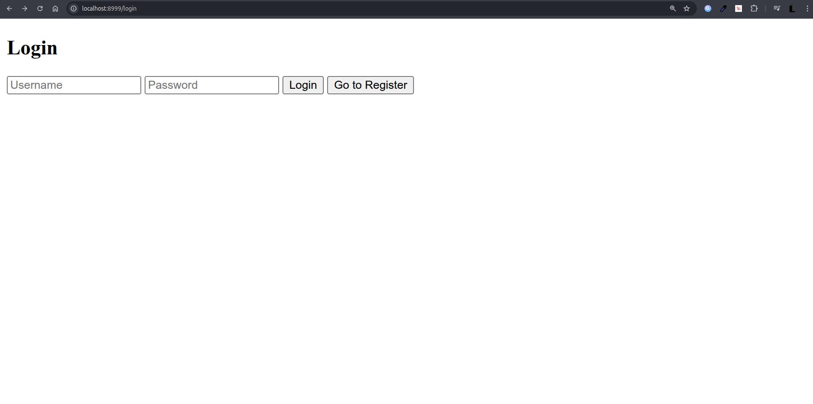
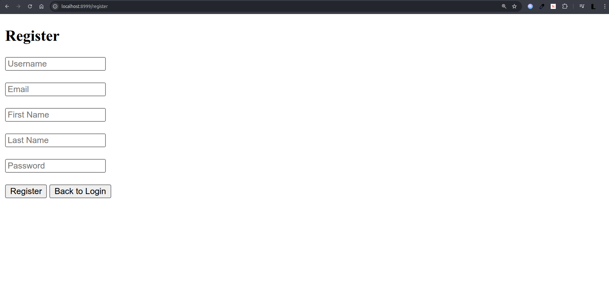
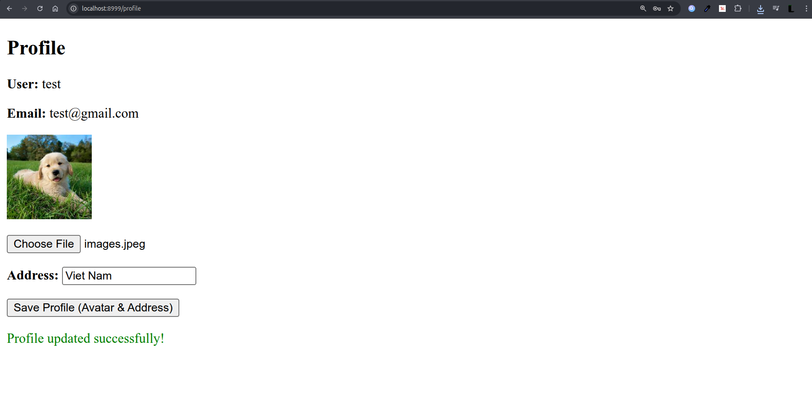
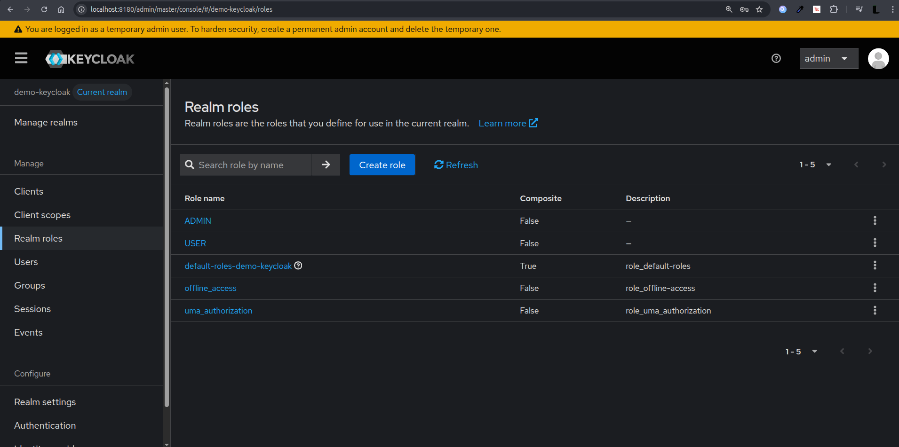
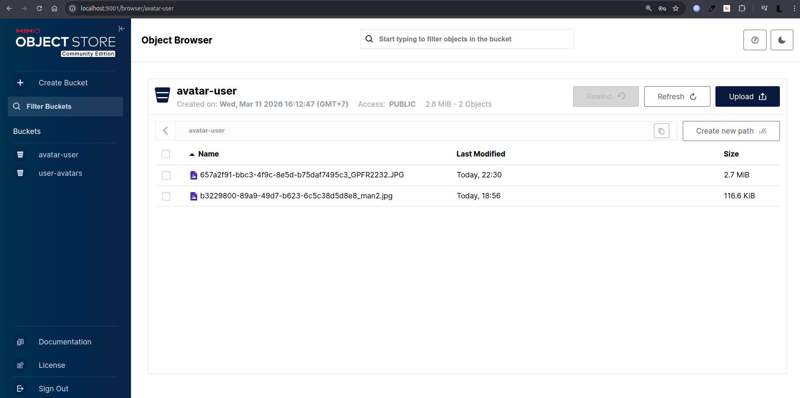

## Tech Stack

- **Spring Boot** 4.0.3
- **Keycloak** 26 (OAuth2 / JWT Resource Server)
- **MinIO** (Object Storage)
- **PostgreSQL**
- **Thymeleaf** + Vanilla JS

---

## Demo

**Login**


**Register**


**Profile**


**Keycloak Admin Console**


**MinIO Console**


---

## 🚀 Getting Started

### 1. Start Infrastructure
```bash
docker compose up -d
```

After starting, configure manually:
- **Keycloak** (`http://localhost:8180`) — create realm, client, user
- **MinIO** (`http://localhost:9001`) — create bucket `avatar-user`

### 2. Configure `application.yaml`
```yaml
idp:
  url: http://localhost:8180
  realm: demo-keycloak
  client-id: demo-spring-keycloak
  client-secret: <your-client-secret>

minio:
  url: http://localhost:9000
  access.name: longpxh
  access.secret: longpxh@123
  bucket.name: avatar-user
```

### 3. Run App
```bash
mvn spring-boot:run
```
